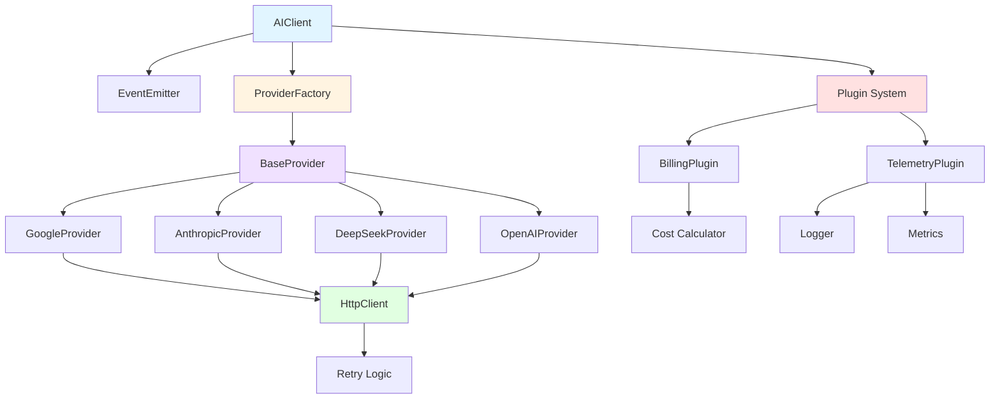
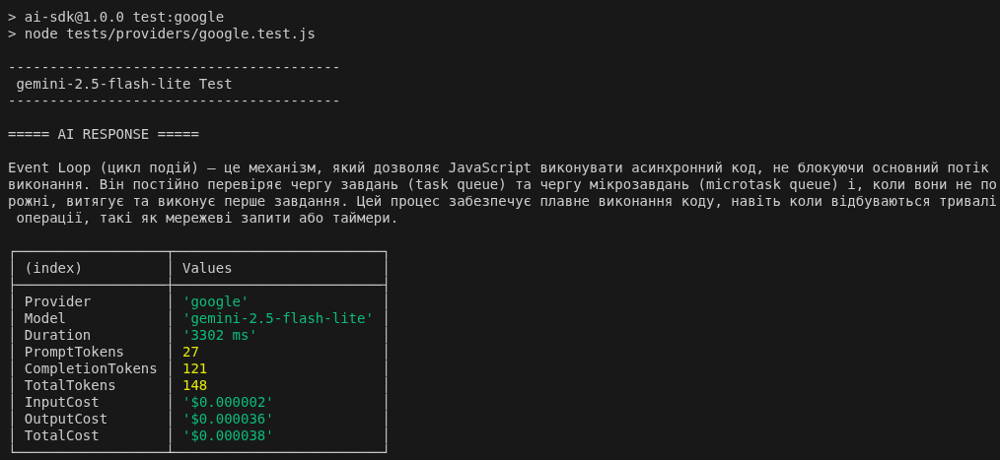
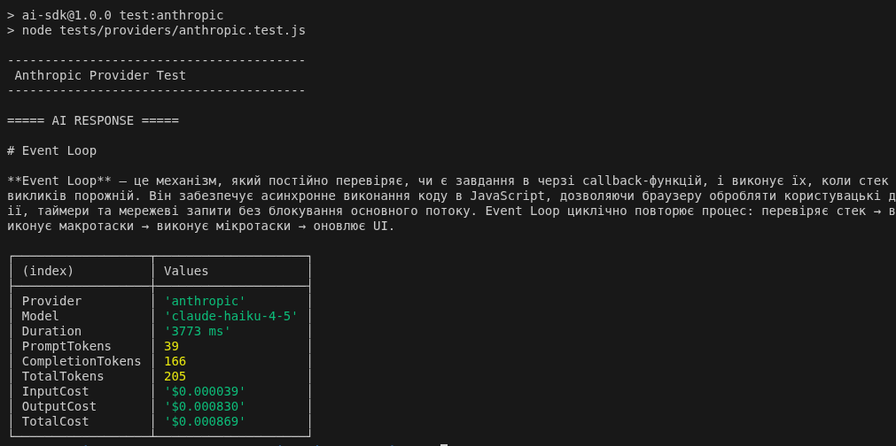
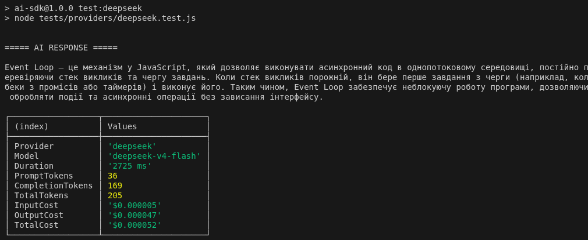
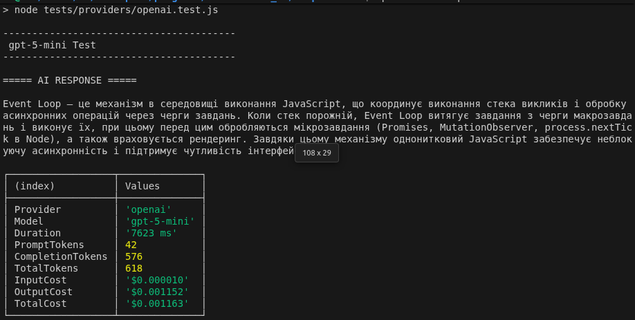

# AI Providers

[](https://www.npmjs.com/package/@testapiw/ai-providers)
[](https://opensource.org/licenses/ISC)

A unified JavaScript SDK for interacting with multiple AI provider APIs (OpenAI, Anthropic, Google, DeepSeek).

**Published on npm**: [@testapiw/ai-providers](https://www.npmjs.com/package/@testapiw/ai-providers)

## Installation

```bash
npm install @testapiw/ai-providers
```

**Available Exports:**
```javascript
import AIClient from "@testapiw/ai-providers";              // Default export
import { Plugin, BillingPlugin, TelemetryPlugin } from "@testapiw/ai-providers"; // Named exports
```

## Quick Start

```javascript
import AIClient, { BillingPlugin, TelemetryPlugin } from "@testapiw/ai-providers";
import models from "./config/models.json" with { type: "json" };

// Initialize client with plugins
const ai = new AIClient({ 
    models,
    http: {
        timeout: 60000,
        retries: 3,
        retryDelay: 1000
    }
}).plugins(
    new BillingPlugin(),
    new TelemetryPlugin()
);

const response = await ai.generate({
    model: "gemini-2.5-flash-lite",
    system: "You are a helpful assistant.",
    prompt: "What is the Event Loop in JavaScript?"
});

console.log(response.text);
console.log(`Cost: $${response.cost.total.toFixed(6)}`);
```

## Overview

This library provides a simplified abstraction layer for working with multiple AI provider APIs through a unified interface. It demonstrates key capabilities including:

- **Multi-provider support**: OpenAI, Anthropic (Claude), Google (Gemini), DeepSeek
- **Plugin architecture**: Modular system for extending functionality
- **Event system**: Lifecycle events for monitoring and customization
- **Automatic retry logic**: Handles transient failures with configurable retry policies
- **Cost tracking**: Via BillingPlugin for detailed usage analytics
- **Telemetry**: Via TelemetryPlugin for logging and metrics
- **Provider abstraction**: Single interface for all AI providers

## Architecture



## Project Structure

```
ai-providers/
├── config/
│   ├── models.json          # Model configurations and pricing
│   └── settings.js          # Environment variables and settings
├── src/
│   ├── index.js            # Main entry point (exports AIClient, plugins)
│   ├── constants/
│   │   └── HttpStatus.js   # HTTP status code constants
│   ├── core/
│   │   ├── AIClient.js         # Main client class
│   │   ├── EventEmitter.js     # Event system for lifecycle hooks
│   │   ├── Plugin.js           # Base plugin class
│   │   ├── HttpClient.js       # HTTP wrapper with retry support
│   │   ├── ProviderFactory.js  # Provider instantiation
│   │   └── Retry.js            # Retry logic implementation
│   ├── plugins/
│   │   ├── BillingPlugin/
│   │   │   ├── BillingPlugin.js # Cost tracking plugin
│   │   │   └── Billing.js      # Billing logic
│   │   └── TelemetryPlugin/
│   │       ├── TelemetryPlugin.js # Telemetry plugin
│   │       ├── Logger.js       # File-based logging
│   │       ├── Metrics.js      # Performance metrics
│   │       ├── FileWriter.js   # Async file writing
│   │       ├── FileRotation.js # Log rotation
│   │       └── Mutex.js        # File write synchronization
│   ├── providers/
│   │   ├── BaseProvider.js     # Abstract base provider
│   │   ├── GoogleProvider.js   # Google Gemini implementation
│   │   ├── AnthropicProvider.js # Claude implementation
│   │   ├── DeepSeekProvider.js  # DeepSeek implementation
│   │   └── OpenAIProvider.js    # OpenAI implementation
│   ├── types/
│   │   ├── AIRequest.js    # Request type definitions
│   │   └── AIResponse.js   # Response type definitions
│   ├── errors/
│   │   └── AIError.js      # Custom error types
│   └── utils/
│       ├── Cost.js         # Cost calculation utilities
│       └── sleep.js        # Async delay utility
├── tests/
│   ├── integration/        # Integration tests
│   └── providers/          # Provider-specific tests
└── logs/                   # Telemetry output directory
```

## Configuration

### Environment Variables

Create a `.env` file with your API keys:

```env
# Google (Gemini)
GEMINI_API_KEY_FREE=your_free_tier_key
GEMINI_API_KEY_PAID=your_paid_tier_key

# Anthropic (Claude)
ANTHROPIC_API_KEY=your_anthropic_key

# DeepSeek
DEEPSEEK_API_KEY=your_deepseek_key

# OpenAI
OPENAI_API_KEY=your_openai_key

# HTTP settings (optional)
AI_TIMEOUT=60000
AI_RETRIES=3
AI_RETRY_DELAY=1000
```

### Models Configuration (`config/models.json`)

Define available models with their settings:

```json
{
  "models": {
    "gemini-2.5-flash-lite": {
      "displayName": "gemini-2.5-flash-lite (Google)",
      "provider": "google",
      "apiModel": "gemini-2.5-flash-lite",
      "temperature": 0.15,
      "maxTokens": 4000,
      "apiTier": "free",
      "api": "interactions",
      "pricing": {
        "input_per_1m": 0.075,
        "output_per_1m": 0.30
      }
    }
  }
}
```

**Configuration Keys:**
- `displayName`: Human-readable model name
- `provider`: Provider identifier (google, anthropic, deepseek, openai)
- `apiModel`: Actual model name used in API requests
- `temperature`: Default temperature for generation (0.0-1.0)
- `maxTokens`: Default maximum output tokens
- `apiTier`: Tier indicator (for Google: "free" or "paid")
- `api`: API type (for Google: "interactions" or other)
- `pricing`: Cost per 1 million tokens
  - `input_per_1m`: Input token cost
  - `output_per_1m`: Output token cost

### Client Configuration

```javascript
import AIClient, { BillingPlugin, TelemetryPlugin } from "@testapiw/ai-providers";
import models from "./config/models.json" with { type: "json" };

// Initialize client
const ai = new AIClient({
    models: models,           // Models configuration object
    http: {
        timeout: 60000,       // Request timeout in milliseconds
        retries: 3,           // Number of retry attempts
        retryDelay: 1000      // Delay between retries in ms
    }
});

// Add plugins (optional)
ai.plugins(
    new BillingPlugin(),      // Cost tracking and billing
    new TelemetryPlugin()     // Logging and metrics
);
```

**Available Plugins:**
- `BillingPlugin`: Tracks API costs and usage
- `TelemetryPlugin`: Provides logging and metrics collection

## Features

### Automatic Retry

The SDK automatically retries failed requests for:
- **HTTP Status Codes**: 429 (Rate Limit), 500, 502, 503, 504
- **Network Errors**: ECONNRESET, ECONNREFUSED, ETIMEDOUT

Retry behavior is configurable via the `http.retries` and `http.retryDelay` settings.

### Cost Tracking

The `BillingPlugin` automatically tracks API costs:

```javascript
import AIClient, { BillingPlugin } from "@testapiw/ai-providers";

const ai = new AIClient({ models })
    .plugins(new BillingPlugin());

const response = await ai.generate({...});

console.log(response.cost);
// {
//   input: 0.000075,     // Input token cost
//   output: 0.000300,    // Output token cost
//   total: 0.000375      // Total cost in USD
// }
```

### Telemetry

The `TelemetryPlugin` provides comprehensive logging and metrics:

```javascript
import AIClient, { TelemetryPlugin } from "@testapiw/ai-providers";

const ai = new AIClient({ models })
    .plugins(new TelemetryPlugin({
        directory: "./logs",        // Log file directory
        maxFileSize: 3 * 1024 * 1024, // Max file size (3MB)
        revisions: 7                  // Number of revisions to keep
    }));
```

**Telemetry Features:**
- **Requests/Responses**: Full API interactions
- **Errors**: Failed requests with context
- **Metrics**: Performance and usage statistics
- **Log Rotation**: Automatic rotation when files exceed `maxFileSize`

### Plugin System

The SDK supports a modular plugin architecture for extensibility:

```javascript
import AIClient, { BillingPlugin, TelemetryPlugin } from "@testapiw/ai-providers";

// Use without plugins (minimal setup)
const ai = new AIClient({ models });

// Or add plugins as needed
const aiWithPlugins = new AIClient({ models })
    .plugins(
        new BillingPlugin(),
        new TelemetryPlugin({ directory: "./logs" })
    );
```

**Creating Custom Plugins:**

```javascript
import AIClient, { Plugin } from "@testapiw/ai-providers";

class CustomPlugin extends Plugin {
    constructor() {
        super("CustomPlugin");
    }
    
    async onRequestStart(request) {
        console.log("Request started:", request.model);
    }
    
    async onRequestEnd(response) {
        console.log("Request completed:", response.text);
    }
    
    async onRequestError(error) {
        console.error("Request failed:", error.message);
    }
}

ai.plugins(new CustomPlugin());
```

**Plugin Events:**
- `request:start` - Fired before API request
- `request:end` - Fired after successful response
- `request:error` - Fired on request failure

### Unified Interface

All providers use the same request format:

```javascript
await ai.generate({
    model: "model-name",           // Required: Model identifier
    system: "System prompt",       // Optional: System message
    prompt: "User prompt",         // Required: User message
    temperature: 0.7,              // Optional: Override default
    maxTokens: 2000                // Optional: Override default
});
```

## API Response

The `generate()` method returns a standardized response:

```javascript
{
    text: "Generated text response",
    usage: {
        promptTokens: 50,
        completionTokens: 200,
        totalTokens: 250
    },
    cost: {
        input: 0.0001,
        output: 0.0005,
        total: 0.0006
    },
    model: "gemini-2.5-flash-lite",
    provider: "google"
}
```

## Error Handling

```javascript
try {
    const response = await ai.generate({
        model: "gemini-2.5-flash-lite",
        prompt: "Hello!"
    });
} catch (error) {
    console.error('Error:', error.message);
    console.error('Provider:', error.provider);
    console.error('Model:', error.model);
    console.error('Duration:', error.duration);
}
```

## Testing

Run provider-specific tests:

```bash
npm run test:google
npm run test:anthropic
npm run test:deepseek
npm run test:logger
```

## Notes on Implementation

This code is intentionally **simplified** to demonstrate core concepts of working with AI APIs. Possible improvements include:

- Type safety with TypeScript
- Streaming response support
- More sophisticated error handling
- Request queuing and rate limiting
- Caching layer
- More comprehensive test coverage
- Support for additional providers (Cohere, Mistral, etc.)
- Function calling / tool use support

## Development Process

This library was **generated using ChatGPT** with iterative prompting and specific implementation examples:

**Initial Prompt:**
> "Create a unified JavaScript SDK for multiple AI providers (OpenAI, Anthropic, Google) with retry logic, cost tracking, and telemetry. Use a factory pattern for providers and ensure clean separation of concerns."

**Follow-up Prompts:**
- "Add automatic retry logic for transient HTTP failures"
- "Implement cost calculation based on token usage and pricing"
- "Add file-based logging with rotation support"
- "Create provider implementations for Google Gemini with API tier support"
- "Add metrics collection for performance monitoring"

The code was refined through multiple iterations with ChatGPT, providing concrete examples of desired behavior and incrementally adding features. This approach demonstrates how AI-assisted development can quickly scaffold functional prototypes while maintaining consistent architectural patterns.

## Test Results

Below are screenshots from running the provider tests:

### Google Gemini Test


### Anthropic Claude Test


### DeepSeek Test


### OpenAI Test



## Supported Models & Features

### Plugin Architecture & Event System (v2.0.0) - 2026-07-20
Version `2.0.0` introduces a major architectural change with a plugin-based system and event-driven design:

- **Event System**: Added `EventEmitter` for lifecycle events (`request:start`, `request:end`, `request:error`)
- **Plugin Architecture**: Introduced modular plugin system with `Plugin` base class for extensibility
- **TelemetryPlugin**: Refactored telemetry (logging and metrics) as a standalone plugin
- **BillingPlugin**: New plugin for cost tracking and billing management
- **Breaking Changes**: Client initialization now uses plugins instead of config-based telemetry
- **Code Organization**: Moved cost calculation utilities to `utils/` for better structure

Plugins can be registered and unregistered dynamically, allowing flexible customization of SDK behavior.

### OpenAI Architecture Fix (v1.0.2)
Starting from version `1.0.2`, the provider includes native handling for next-generation reasoning models (`gpt-5`, `gpt-5-mini`, and `o`-series). 


## License

ISC

## Contributing

This is a demonstration project. Feel free to fork and extend with additional features or providers.
